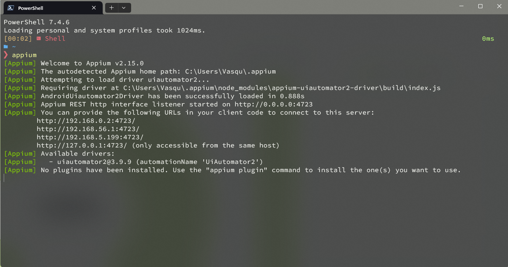
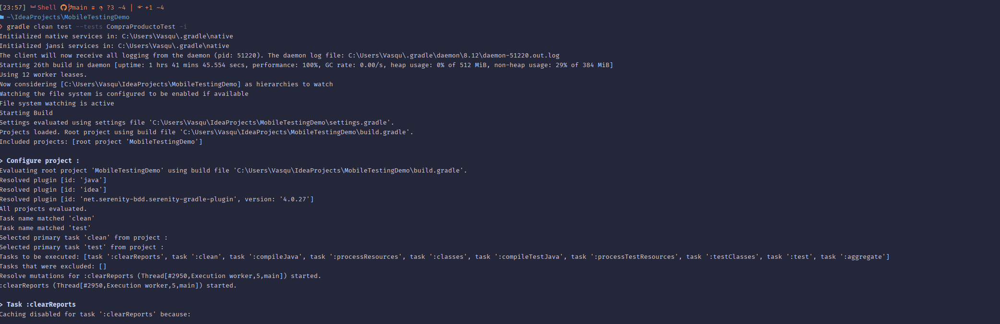
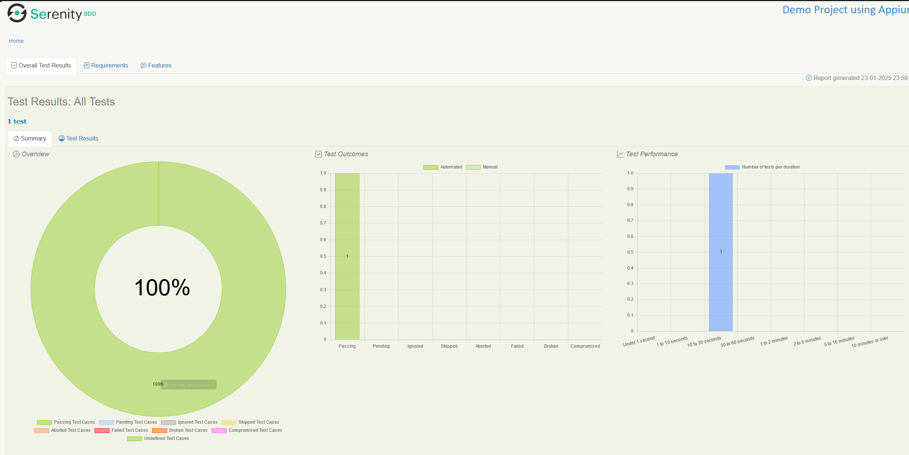

# Mobile Testing Demo

## Consideraciones

Asegúrese de tener instalados los siguientes componentes:
*las versiones utilizadas que se muestran son las recomendadas, si tiene versiones anteriores y presenta inconvenientes debera actualizarlas*

- Java (JDK) 21.0.2
- Gradle 8.12
- Node.js 22.12.0
- Appium 2.15
- Android Studio 2024.1.1 (Koala)

## Instalacion de appium
**Con node instalado**
   
1. npm install -g appium
2. appium driver install uiautomator2

## Instalacion de Gradle, Android Studio
    1. Gradle: Dirigirse al sitio oficial y seguir la guia de instalacion https://gradle.org/install/

    2. Android Studio: Dirigirse a la pagina oficial y descargar el instalador y ejecutandolo posteriormente.
    Asegurese de tener configurada la variable de entorno con la ruta correcta, normalmente es la siguiente
    ANDROID_HOME -> C:\Users\*tu usuario*\AppData\Local\Android\Sdk 
    https://developer.android.com/studio
    
## Instrucciones de Ejecución

1. **Ejecutar Emulador**

   Abra Android Studio y ejecute un emulador de Android desde el AVD Manager con la version de Android 15 (API 35).


2. **Iniciar Appium**

   En una terminal, ejecute el siguiente comando para iniciar el servidor de Appium:
   ```bash
   appium
   ```
   

3. **Ejecutar Tests**

   En otra terminal, navegue al directorio del proyecto y ejecute los tests con Gradle:
   ```bash
   gradle clean test --tests CompraProductoTest -i
   ```


## Reportes

**Visualizar reporte generado**

El proyecto generara un reporte por defecto con la cobertura de pruebas y capturas de pantalla de cada paso realizado.

Se podra acceder a el de manera manual al finalizar el test en el enlace que aparecera en consola.

Tambien se podra acceder a el desde la ruta (relativa al proyecto) siguiente:

**/target/site/serenity/index.html**

lo cual nos mostrara en el navegador un reporte similar a este



## Capabilities

**Las capabilities implementadas son las siguientes:

* webdriver.driver= appium

* appium.hub = http://localhost:4723/

####### Android CAPABILITIES ######
* appium.automationName=UiAutomator2
* appium.platformName = Android
* appium.platformVersion = 15.0
* appium.deviceName  = Pixel8API35
* appium.udid = emulator-5554
* appium.app =  ${user.dir}/src/test/resources/demoApp.apk
* appium.autoGrantPermissions = true
* appium.disableIdLocatorAutocompletion = true

si se desean cambiar cualquier valor se debe realizar en el archivo serenity.properties 
no se recomienda cambiar los valores de: appium.hub, appium.app (la app ya esta configurada en el proyecto) y appium.automationName

